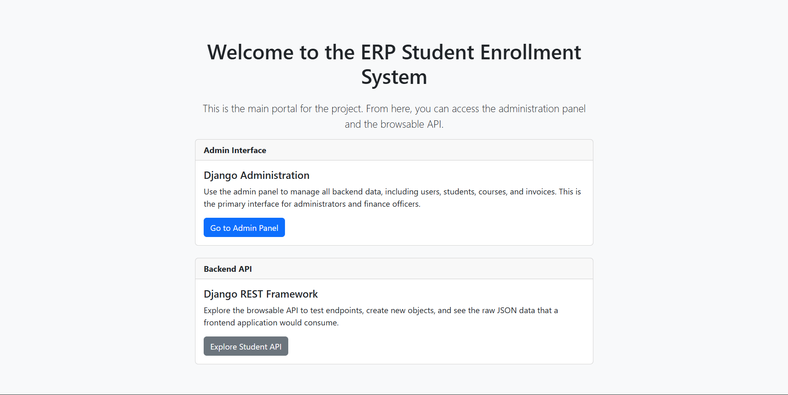

# ERP-like Student Enrollment & Financial Management System



<p align="center">
  
  &nbsp; <!-- adds some space between the images -->
  
</p>


A full-stack, modular ERP system built with Python and Django to manage student information, course enrollment, and automated financial processing. This project mimics enterprise-level business workflows by integrating a powerful Oracle Database backend with automated PL/SQL procedures and triggers.

---

## 🌟 Key Features

*   **👨‍🎓 Student Management:** Full CRUD functionality for student profiles, including academic and contact information.
*   **📚 Course & Enrollment System:** Administrators can manage courses and enroll students, with validation logic to prevent duplicate enrollments.
*   **🤖 Automated Invoicing:** On successful enrollment, a **PL/SQL Stored Procedure** is automatically triggered to generate a financial invoice, eliminating manual data entry.
*   **💳 Real-time Financial Integrity:** An **Oracle Database Trigger** automatically updates an invoice's status to "Paid" when a payment is recorded, ensuring an accurate and up-to-date financial record.
*   **🔐 Role-Based Access Control (RBAC):** Utilizes Django's built-in authentication and groups to create distinct roles (Admin, Finance Officer, Student) with segregated permissions.
*   **🚀 Secure RESTful API:** A comprehensive API built with Django REST Framework provides endpoints for all major functionalities.

---

## ⚙️ Technology Stack

*   **Backend:** Python, Django, Django REST Framework
*   **Database:** Oracle Database (SQL, PL/SQL, Stored Procedures, Triggers)
*   **Frontend:** Django Templates with Bootstrap for the Admin Panel & Homepage
*   **Tools:** Git, Virtualenv, `python-oracledb`

---

## 🚀 System Workflow

The application follows a logical, automated workflow that mirrors real-world business processes:

1.  **Setup:** An **Admin** creates user accounts, defines courses, and sets up student profiles via the Django Admin Panel.
2.  **Enrollment:** The Admin enrolls a student in a course.
3.  **Invoice Automation:** The moment the enrollment is saved, a `post_save` signal fires, calling a **PL/SQL Stored Procedure** in the Oracle DB. This procedure instantly creates an invoice with the correct fee and an "Unpaid" status.
4.  **Payment & Reconciliation:** A **Finance Officer** records a payment against the invoice.
5.  **Status Automation:** The moment the payment is recorded, a **Database Trigger** on the payments table automatically updates the original invoice's status to "Paid", closing the financial loop.

---

## 🛠️ Setup and Installation

### Prerequisites

*   Python 3.8+
*   Git
*   Oracle Database (12c or later)
*   Oracle Instant Client (with its path added to the system's PATH environment variable)

### Installation Steps

1.  **Clone the repository:**
    ```bash
    git clone https://github.com/namanabbad02/ERP-like-Student-Enrollment-System.git
    cd erp-student-enrollment-django
    ```

2.  **Create and activate a virtual environment:**
    ```bash
    python -m venv venv
    source venv/bin/activate  # On Windows: venv\Scripts\activate
    ```

3.  **Install the required dependencies:**
    ```bash
    pip install -r requirements.txt
    ```

4.  **Configure the database in `settings.py`:**
    Update the `DATABASES` dictionary in `erp_project/settings.py` with your Oracle DB credentials.
    ```python
    DATABASES = {
        'default': {
            'ENGINE': 'django.db.backends.oracle',
            'NAME': 'localhost:1521/YourServiceName',
            'USER': 'your_db_user',
            'PASSWORD': 'your_db_password',
        }
    }
    ```

### Database Setup (Oracle)

The database automation relies on a stored procedure and a trigger. Run the SQL scripts located in the `/sql` directory (or provide the code below) on your Oracle database to set them up.

*   `GENERATE_INVOICE_FOR_ENROLLMENT` (Stored Procedure)
*   `UPDATE_INVOICE_ON_PAYMENT` (Trigger)

### Running the Application

1.  **Apply the database migrations:**
    ```bash
    python manage.py migrate
    ```

2.  **Create a superuser to access the Admin Panel:**
    ```bash
    python manage.py createsuperuser
    ```

3.  **Create User Groups:**
    Log into the admin panel and create the following user groups: `Admin`, `Finance Officer`, `Student`.

4.  **Start the development server:**
    ```bash
    python manage.py runserver
    ```
    The application will be available at `http://127.0.0.1:8000/`.

---

## 🔗 API Endpoints

The browsable API can be accessed at `/api/`.

*   `/api/students/`
*   `/api/courses/`
*   `/api/enrollments/`
*   `/api/invoices/`

---

## 🔮 Future Enhancements

*   Develop a dedicated frontend dashboard for Students using a modern framework like React or Vue.js.
*   Integrate a payment gateway (e.g., Stripe) for online fee payment.
*   Implement advanced reporting and analytics for popular courses and financial summaries.
*   Add email notifications for invoice generation and payment confirmations.
